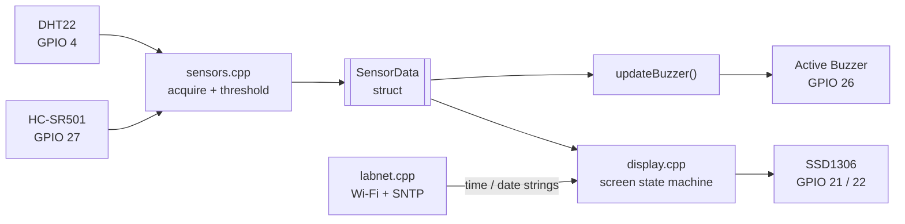

# LabSense

**An interactive smart lab environment monitor built on the ESP32 platform.**

LabSense turns an ESP32 DevKit V1 into a self-contained, always-on desk appliance for a lab or workshop. It continuously tracks ambient temperature and humidity, keeps an accurate wall clock and calendar synchronised over the internet, notices when someone walks up to the bench and greets them, and raises an audible alarm when the environment drifts out of a safe range — all on a 0.96" OLED, with no blocking code anywhere in the firmware.

The entire runtime is **strictly non-blocking**: there is not a single `delay()` in the project. Every task is edge-triggered or `millis()`-throttled, so the main loop stays responsive to the PIR sensor while the Wi-Fi stack, the SNTP client, and the sensor pipeline all make progress in the background.

---

## Table of Contents

1. [Project Overview](#1-project-overview)
2. [Hardware Bill of Materials](#2-hardware-bill-of-materials-bom)
3. [Wiring & Pinout](#3-wiring--pinout)
4. [Firmware Architecture](#4-firmware-architecture)
5. [Setup, Installation & Flashing](#5-setup-installation--flashing)
6. [Usage & Behavioural Logic](#6-usage--behavioural-logic)
7. [Configuration Reference](#7-configuration-reference)
8. [Troubleshooting](#8-troubleshooting)
9. [Roadmap](#9-roadmap)
10. [License](#10-license)

---

## 1. Project Overview

LabSense is an open-source environmental awareness node designed for makers, lab technicians, and embedded engineers who want a dependable bench monitor that is easy to read at a glance and trivial to extend.

### Core Features

| Feature | Description |
| :--- | :--- |
| **Real-time temperature & humidity** | A DHT22 (AM2302) is polled on a strict 2-second cycle — the minimum safe interval for the part. The last known-good reading is cached, so a single dropped sample never blanks the dashboard. |
| **Non-blocking NTP clock & calendar** | The ESP32 associates with a 2.4 GHz Wi-Fi network and synchronises against `pool.ntp.org` / `time.nist.gov` via the ESP-IDF SNTP client. Association and sync both happen in the background; the UI renders placeholder glyphs until the clock is valid and never stalls waiting for it. |
| **Motion-triggered greeting** | An HC-SR501 PIR module fires a rising-edge event when someone approaches the bench, which promotes a full-screen welcome card for 3 seconds. |
| **Optimised OLED dashboard** | A 128x64 SSD1306 over hardware I2C, driven by a priority-based screen state machine so the most urgent information always wins the display. |
| **Audible chime & alerts** | An active buzzer produces a short 120 ms confirmation chime on motion, and an intermittent alarm pattern while a high-temperature condition persists. |
| **Auto-healing Wi-Fi** | The link is health-checked every 10 seconds and re-associated on loss, without ever blocking the render loop. |

> **Note on project history:** LabSense originally included an MQ-136 H2S gas sensor. That sensor has been **removed** from the design, and the active buzzer has been **repurposed** from a gas-leak siren into a dual-role UI chime (motion acknowledgement) and thermal alarm. `GPIO 34 (ADC1_CH6)` is consequently free and unused in the current build.

---

## 2. Hardware Bill of Materials (BOM)

| # | Component | Specification / Notes | Qty |
| :-- | :--- | :--- | :--: |
| 1 | **ESP32 DevKit V1** | NodeMCU-32S / ESP-WROOM-32 module. 30-pin and 38-pin variants both work; confirm your board's silkscreen pin labels before wiring. | 1 |
| 2 | **DHT22 (AM2302)** | Temperature & humidity sensor. Range -40 °C…+80 °C (±0.5 °C) and 0–100 % RH (±2–5 %). The 3-pin breakout version is recommended — it ships with the data-line pull-up already fitted. | 1 |
| 3 | **HC-SR501 PIR Motion Sensor** | Passive infrared module with on-board regulator. Two trim pots (sensitivity, time-delay) and a repeat/single-trigger jumper. | 1 |
| 4 | **0.96" SSD1306 OLED** | 128x64 monochrome, **I2C interface** (4-pin: VCC / GND / SCL / SDA). Default bus address `0x3C`. SPI variants are *not* compatible with this firmware without modification. | 1 |
| 5 | **Active Buzzer Module** | 3.3 V / 5 V active (self-oscillating) buzzer. Use a 3-pin driver module with an on-board transistor — a bare piezo element must not be driven directly from a GPIO. | 1 |
| 6 | **Breadboard & jumper wires** | Half-size (400-point) breadboard plus male-to-male / male-to-female Dupont leads. | — |
| 7 | **Power supply** | 5 V @ 1 A minimum, via Micro-USB or USB-C depending on your DevKit revision. Wi-Fi TX bursts draw current spikes of ~350–500 mA; an underpowered supply is the single most common cause of random reboots. | 1 |

---

## 3. Wiring & Pinout

### 3.1 Connection Table

| Component | Module Pin | ESP32 GPIO | Signal Type | Voltage Rail |
| :--- | :--- | :--- | :--- | :--- |
| **SSD1306 OLED** | `VCC` | `3V3` | Power | **3.3 V** |
| | `GND` | `GND` | Ground | — |
| | `SDA` | **`GPIO 21`** | I2C data (bidirectional, open-drain) | 3.3 V logic |
| | `SCL` | **`GPIO 22`** | I2C clock (open-drain) | 3.3 V logic |
| **DHT22 (AM2302)** | `VCC` / `+` | `3V3` | Power | **3.3 V** |
| | `DATA` / `OUT` | **`GPIO 4`** | Single-wire bidirectional digital (proprietary) | 3.3 V logic |
| | `GND` / `-` | `GND` | Ground | — |
| **HC-SR501 PIR** | `VCC` | `VIN` / `5V` | Power | **5 V** (module needs 4.5–20 V) |
| | `OUT` | **`GPIO 27`** | Digital input, active-HIGH | **3.3 V logic** (regulated on-module) |
| | `GND` | `GND` | Ground | — |
| **Active Buzzer** | `VCC` / `+` | `3V3` | Power | **3.3 V** (module tolerates 3.3–5 V) |
| | `I/O` / `S` | **`GPIO 26`** | Digital output, active-HIGH | 3.3 V logic |
| | `GND` / `-` | `GND` | Ground | — |

### 3.2 Wiring Map

```text
                        ESP32 DevKit V1
                     +-------------------+
     SSD1306 OLED    |                   |    HC-SR501 PIR
   +-----------+     |                   |   +------------+
   | VCC ------+-----+ 3V3          VIN  +---+------ VCC  |
   | GND ------+-----+ GND          GND  +---+------ GND  |
   | SDA ------+-----+ GPIO 21   GPIO 27 +---+------ OUT  |
   | SCL ------+-----+ GPIO 22           |   +------------+
   +-----------+     |                   |
                     |                   |    Active Buzzer
      DHT22          |                   |   +------------+
   +-----------+     |              3V3  +---+------ VCC  |
   | VCC ------+-----+ 3V3          GND  +---+------ GND  |
   | DATA -----+-----+ GPIO 4    GPIO 26 +---+------ I/O  |
   | GND ------+-----+ GND               |   +------------+
   +-----------+     |   GPIO 34 (free)  |
                     +-------------------+
```

### 3.3 Why These Pins?

Pin assignment on the ESP32 is not arbitrary — several GPIOs are reserved, bootstrap-sensitive, or electrically restricted. Every pin in LabSense was chosen deliberately:

- **`GPIO 21` / `GPIO 22` — hardware I2C.** These are the ESP32's default `SDA` / `SCL` pins. Using them means `Wire.begin(21, 22)` binds to the silicon I2C peripheral rather than a bit-banged software bus, which keeps the OLED refresh cheap and frees CPU time for the main loop. The SSD1306 module carries its own pull-up resistors on both lines, so no external pull-ups are required.
- **`GPIO 4` — DHT22 data.** A plain, unencumbered GPIO with no boot-time role. The DHT protocol is a bidirectional single-wire exchange that needs a **4.7 kΩ–10 kΩ pull-up to 3.3 V**; 3-pin DHT22 breakout boards include this resistor, but if you are using a bare 4-pin sensor you must fit one yourself between `DATA` and `3V3`.
- **`GPIO 27` — PIR input.** A general-purpose pin that is *not* a strapping pin and is not tied to the SPI flash. The HC-SR501's output stage is regulated to **3.3 V even when the module is powered from 5 V**, so it connects directly to the ESP32 — no level shifter, no divider. (ESP32 GPIOs are *not* 5 V tolerant, so this detail matters.)
- **`GPIO 26` — buzzer output.** Safe at boot: it does not float or pulse during reset, so the buzzer stays silent through power-up. An ESP32 pin sources roughly 20 mA continuous, which is why the BOM specifies a buzzer **module** with an integrated driver transistor rather than a bare element.
- **Pins deliberately avoided.** `GPIO 6–11` are hard-wired to the on-board SPI flash and will break the boot if used. `GPIO 0`, `2`, `12`, and `15` are **strapping pins** sampled at reset — an external pull on any of them can force the chip into download mode or select the wrong flash voltage. `GPIO 34–39` are **input-only** with no internal pull-ups, which is why the now-retired MQ-136 lived on `GPIO 34` (analogue input) and why that pin is unsuitable for the buzzer or any other output.
- **ADC discipline.** `ADC2` is commandeered by the Wi-Fi driver and cannot be read while the radio is active. LabSense currently performs **no analogue reads at all**; should you add one, it must be mapped to an `ADC1` pin (`GPIO 32–39`).

---

## 4. Firmware Architecture

### 4.1 Design Philosophy

`LabSense.ino` is an **orchestrator, not an implementation**. It owns exactly one piece of state — a single `SensorData` struct — and its `loop()` does nothing but call four module update functions in a fixed order, each of which returns immediately:

```cpp
void loop() {
  updateNetwork();      // Wi-Fi health check (throttled to 10 s)
  updateSensors(data);  // DHT poll (throttled to 2 s) + PIR level read
  updateBuzzer(data);   // edge-triggered chime + alarm pattern
  updateDisplay(data);  // priority-based screen state machine
  yield();              // let the IDF scheduler service Wi-Fi / SNTP
}
```

This yields a **zero-blocking runtime**:

- **No `delay()` anywhere.** Not in setup, not in the loop, not in any module.
- **No busy-wait on the network.** `initNetwork()` fires `WiFi.begin()` and `configTime()` and returns instantly; association and SNTP sync complete asynchronously in the IDF task.
- **No blocking time reads.** `getLocalTime()` is called with an explicit `0` timeout, bypassing the Arduino core's default 5-second wait. Until the clock is genuinely synced it simply reports failure, and the UI renders placeholders.
- **Throttled, not stalled.** Each periodic task compares `millis()` against its own timestamp and returns early — the DHT at 2 s, the Wi-Fi check at 10 s, the buzzer patterns at millisecond granularity.
- **Edge-triggered events.** Motion is detected by comparing the current PIR level against the previous one, so a single approach produces exactly one chime and one welcome card, regardless of how long a person lingers.
- **Graceful degradation.** If the OLED fails to initialise, `updateDisplay()` short-circuits and the rest of the system keeps running. If a DHT read returns `NaN`, the previous valid sample is retained and the `dhtValid` flag drives the fallback `--` rendering.

### 4.2 Data Flow



`SensorData` is the single source of truth passed between modules:

```cpp
struct SensorData {
  float temperature      = NAN;    // deg C, last known-good
  float humidity         = NAN;    // % RH, last known-good
  bool  motionDetected   = false;  // live PIR level
  bool  dhtValid         = false;  // false until a clean read lands
  bool  temperatureAlert = false;  // evaluated against TEMP_ALERT_THRESHOLD
};
```

### 4.3 File Tree & Module Responsibilities

```text
LabSense/
├── LabSense.ino          # Orchestrator. setup() wires up the three subsystems;
│                         # loop() fans out to four non-blocking update calls.
│                         # Owns the single SensorData instance. No business logic.
│
├── config.h              # Single source of truth for all compile-time constants:
│                         # GPIO map, screen geometry, I2C address, poll intervals,
│                         # alarm thresholds, buzzer timings, NTP servers, UTC offset.
│                         # Change behaviour here — not in the .cpp files.
│
├── sensors.h             # Public API + the SensorData contract.
├── sensors.cpp           # DHT22 acquisition with 2 s throttle and last-known-good
│                         # caching; PIR digital read; temperature threshold
│                         # evaluation; the complete non-blocking buzzer state
│                         # machine (one-shot motion chime + repeating thermal alarm).
│
├── display.h             # Public API: initDisplay() / updateDisplay().
├── display.cpp           # SSD1306 lifecycle and the priority-based screen state
│                         # machine. Owns the centred-text helper and all glyph
│                         # layout. Reads formatted clock strings from labnet.
│
├── labnet.h              # Public API: connection state + formatted time / date.
├── labnet.cpp            # Wi-Fi STA association, 10 s reconnect supervision,
│                         # SNTP configuration, and zero-timeout time formatting
│                         # with placeholder fallbacks.
│
├── secrets.h.example     # Template for credentials. Copy -> secrets.h.
├── secrets.h             # YOUR credentials. Git-ignored. Never committed.
│
├── Resources/            # Schematics, diagrams, and reference images.
├── CLAUDE.md             # Contributor / AI-assistant guardrails for this repo.
├── LICENSE               # MIT.
└── README.md             # You are here.
```

### 4.4 Why `labnet` and Not `network`?

The networking module is named **`labnet.h` / `labnet.cpp`** rather than the more obvious `network.h` / `network.cpp`. This is a deliberate portability fix, not a stylistic choice.

ESP32 Arduino Core **v3.x** ships a core header named **`Network.h`**. On Linux and case-sensitive filesystems, `network.h` and `Network.h` are distinct files and nothing collides. **On Windows — and on case-insensitive macOS APFS volumes — they are the same filename.** A local `network.h` sitting in the sketch directory therefore *shadows* the core header: the compiler resolves `#include <Network.h>` to the sketch's own file, `WiFi.h` fails to find `NetworkInterface` and `network_event_handle_t`, and the build dies with a wall of confusing type errors that give no hint as to the real cause.

Renaming to `labnet` removes any possibility of collision on every platform. As a belt-and-braces measure, `labnet.cpp` also pre-includes the core header behind a feature test before pulling in `WiFi.h`:

```cpp
#if __has_include(<Network.h>)
#include <Network.h>   // Core 3.x: WiFi.h needs these types declared first
#endif
#include <WiFi.h>
```

**If you fork this project, do not rename `labnet` back to `network`.**

---

## 5. Setup, Installation & Flashing

### 5.1 Prerequisites

| Requirement | Version | Notes |
| :--- | :--- | :--- |
| **Arduino IDE** | 2.x (or `arduino-cli` 0.35+) | Either toolchain works; both are covered below. |
| **ESP32 Board Package** | **v3.x** (`esp32` by Espressif Systems) | v3.x is assumed throughout. The `labnet` naming guard above specifically targets its `Network.h`. |
| **USB-to-UART driver** | CP210x or CH340, per your board | Required on Windows if no serial port appears after plugging in the DevKit. |

**Installing the board package (Arduino IDE 2.x):**

1. `File -> Preferences -> Additional boards manager URLs`, add:
   `https://espressif.github.io/arduino-esp32/package_esp32_index.json`
2. `Tools -> Board -> Boards Manager…`, search **esp32**, install the Espressif Systems package (v3.x).

### 5.2 Required Libraries

Install all four via `Tools -> Manage Libraries…`:

| Library | Author | Purpose |
| :--- | :--- | :--- |
| **Adafruit SSD1306** | Adafruit | OLED driver |
| **Adafruit GFX Library** | Adafruit | Graphics primitives and fonts (dependency of the above) |
| **DHT sensor library** | Adafruit | DHT22 / AM2302 protocol |
| **Adafruit Unified Sensor** | Adafruit | Required dependency of the DHT library |

`Wire.h`, `WiFi.h`, and `time.h` ship with the ESP32 core — nothing to install.

Via CLI:

```bash
arduino-cli lib install "Adafruit SSD1306" "Adafruit GFX Library" "DHT sensor library" "Adafruit Unified Sensor"
```

### 5.3 Clone & Configure Secrets

```bash
git clone https://github.com/Eng-Meshari/LabSense.git
cd LabSense
cp secrets.h.example secrets.h      # Windows PowerShell: Copy-Item secrets.h.example secrets.h
```

Open `secrets.h` and set your network credentials:

```cpp
#define WIFI_SSID     "YourNetworkName"
#define WIFI_PASSWORD "YourNetworkPassword"
```

> **2.4 GHz only.** The ESP32's radio does not support 5 GHz. If your router broadcasts a single merged SSID across both bands, either split the bands or create a dedicated 2.4 GHz network. A wrong-band SSID looks identical to a wrong password: the board simply never associates.

> **`secrets.h` is listed in `.gitignore` and must never be committed.** Only `secrets.h.example` — containing placeholders — belongs in version control. The template also carries MQTT, REST API, and OTA fields reserved for future work; **the current firmware reads only `WIFI_SSID` and `WIFI_PASSWORD`**, so the remaining entries can be left at their placeholder values.

### 5.4 Board Settings

Select **`Tools -> Board -> ESP32 Arduino -> ESP32 Dev Module`**, then match the following:

| Setting | Value |
| :--- | :--- |
| **Board** | ESP32 Dev Module |
| **Upload Speed** | `921600` (drop to `115200` if uploads fail or the cable is long / unshielded) |
| **CPU Frequency** | `240 MHz (WiFi/BT)` |
| **Flash Frequency** | `80 MHz` |
| **Flash Mode** | `QIO` |
| **Flash Size** | `4 MB (32 Mb)` |
| **Partition Scheme** | `Default 4MB with spiffs (1.2MB APP / 1.5MB SPIFFS)` |
| **Core Debug Level** | `None` (raise to `Info` when diagnosing Wi-Fi) |
| **PSRAM** | `Disabled` |
| **Port** | Your board's COM / `/dev/ttyUSB*` / `/dev/cu.*` port |

**Serial Monitor baud rate: `115200`** — this must match `SERIAL_BAUD_RATE` in `config.h`.

### 5.5 Compile & Flash

**Arduino IDE:** open `LabSense.ino` (all module files load as tabs automatically), then **Verify** followed by **Upload**.

**arduino-cli:**

```bash
# Compile
arduino-cli compile --fqbn esp32:esp32:esp32 .

# Upload — substitute your port
arduino-cli upload -p COM5 --fqbn esp32:esp32:esp32 .

# Watch the boot log
arduino-cli monitor -p COM5 -c baudrate=115200
```

> Some DevKit V1 clones need the **BOOT** button held down as the upload begins, released once "Connecting…" turns into "Writing…".

### 5.6 Verifying a Good Boot

A healthy start-up prints:

```text
--- LabSense boot ---
[ok] sensors DHT22/PIR/buzzer
[ok] display SSD1306 128x64
[..] network Wi-Fi associating, NTP in background
--- running ---
```

The OLED lights immediately. Temperature and humidity populate within ~2 seconds. The clock shows `--:--:-- --` and `--/--/----` until Wi-Fi associates and SNTP lands — typically a few seconds after boot.

---

## 6. Usage & Behavioural Logic

### 6.1 Priority-Based Screen State Machine

`updateDisplay()` re-evaluates priority on every pass and renders exactly one screen. Higher priority always pre-empts lower:

| Priority | Screen | Trigger Condition | Contents |
| :--: | :--- | :--- | :--- |
| **1 (highest)** | **Thermal Warning** | `temperature >= 30.0 °C` **and** the DHT reading is valid | `WARNING!` (2x text), `High Temp`, and the live `Temp: xx.x C` value |
| **2** | **Welcome / Motion** | Within **3 seconds** of a PIR rising edge | `Welcome` / `to` / `Rimalx Lab`, centred, 2x text |
| **3 (default)** | **Dashboard** | Everything else | `RimalSense` header, `Temp: xx.x C`, `Hum : xx%`, date `DD/MM/YYYY`, clock `hh:mm:ss AM/PM` |

Because the thermal warning sits above the welcome card, an over-temperature condition cannot be masked by someone walking past the sensor — the alarm screen stays up until the temperature falls back below threshold.

**Sensor-failure rendering.** When `dhtValid` is `false` (sensor unplugged, wiring fault, or a corrupted checksum before any good read), the dashboard shows `Temp: --` and `Hum : --` rather than stale or `NaN` values.

**Clock placeholders.** Before SNTP sync completes, the date and time render as `--/--/----` and `--:--:-- --`. They switch to live values the instant the system clock becomes valid — no reboot needed.

> The clock is formatted as a **12-hour time with an AM/PM suffix** (`%I:%M:%S %p`) and the date as **`DD/MM/YYYY`** (`%d/%m/%Y`). Note that the doc comments in `labnet.h` still describe the older `HH:MM:SS` / `YYYY-MM-DD` formats; the implementation in `labnet.cpp` is authoritative.

### 6.2 Buzzer Feedback Behaviour

The active buzzer on `GPIO 26` serves two distinct, non-blocking roles:

| Event | Pattern | Timing Constant |
| :--- | :--- | :--- |
| **Motion chime** | A single short beep on the **rising edge** of the PIR signal — one chime per approach, never a continuous tone while a person remains in frame. | `MOTION_BEEP_DURATION` = **120 ms** |
| **Thermal alarm** | A repeating intermittent beep for as long as the over-temperature condition holds: approximately **300 ms on, 700 ms off**, i.e. one pulse per second. | `TEMP_BEEP_ON_TIME` = **300 ms**, `TEMP_BEEP_OFF_TIME` = **1000 ms** |
| **Normal operation** | Silent. The buzzer pin is driven `LOW` on init and whenever no alert is active. | — |

Both patterns are driven purely by `millis()` comparisons — the buzzer never holds up the loop, and the display keeps refreshing at full rate throughout an alarm.

### 6.3 Tuning the PIR Module

The HC-SR501 has two potentiometers and a jumper that materially change the feel of the greeting:

- **Sensitivity (Sx):** clockwise increases detection range (roughly 3 m to 7 m). Start mid-travel.
- **Time delay (Tx):** how long `OUT` stays HIGH after a trigger. Turn **fully counter-clockwise** for the shortest hold (~3 s) — this best matches the 3-second welcome window.
- **Trigger jumper:** set to **`H` (repeatable)** so continued presence keeps the output asserted, or **`L` (single)** so each motion event produces one discrete pulse.
- **Warm-up:** the sensor needs **30–60 seconds** after power-up to stabilise its IR baseline. Spurious triggers during that window are normal and expected.

---

## 7. Configuration Reference

All tunable behaviour lives in `config.h`. The values below are the shipped defaults.

### Timing & Polling

| Constant | Default | Meaning |
| :--- | :--- | :--- |
| `SERIAL_BAUD_RATE` | `115200` | Serial monitor baud rate. |
| `DHT_READ_INTERVAL` | `2000` ms | DHT22 poll period. **Do not lower this** — 2 s is the sensor's minimum sampling interval; faster polling returns stale or failed reads. |
| `WIFI_RECONNECT_INTERVAL` | `10000` ms | How often the Wi-Fi link is health-checked and re-associated if dropped. |
| `SENSOR_POLL_RATE` | `500` ms | Reserved for a future sensor-tier throttle; not consumed by the current build. |
| `DISPLAY_PAGE_TIME` | `3000` ms | Intended page dwell time. The motion-screen window in `display.cpp` currently uses a literal `3000` with the same effective value. |
| `DISPLAY_REFRESH_INTERVAL` | `200` ms | Reserved. The OLED presently redraws once per `loop()` pass; wiring this constant into `updateDisplay()` is an easy first contribution (see [Roadmap](#9-roadmap)). |

### Alarm Thresholds

| Constant | Default | Meaning |
| :--- | :--- | :--- |
| `TEMP_ALERT_THRESHOLD` | `30.0` °C | Temperature at or above which the thermal warning screen and alarm pattern engage. |
| `MOTION_BEEP_DURATION` | `120` ms | Length of the one-shot motion chime. |
| `TEMP_BEEP_ON_TIME` | `300` ms | Tone-on duration within each alarm cycle. |
| `TEMP_BEEP_OFF_TIME` | `1000` ms | Alarm cycle period. |

### Network & Time

| Constant | Default | Meaning |
| :--- | :--- | :--- |
| `NTP_SERVER_1` | `pool.ntp.org` | Primary time source. |
| `NTP_SERVER_2` | `time.nist.gov` | Fallback time source. |
| `GMT_OFFSET_SEC` | `3 * 3600` | UTC offset in seconds — **UTC+3 (Arabia Standard Time)** by default. Set to your own zone, e.g. `0` for UTC or `-5 * 3600` for EST. |
| `DAYLIGHT_OFFSET_SEC` | `0` | Additional DST offset in seconds. Set to `3600` in regions that observe daylight saving. |

### Display & Pins

| Constant | Default | Meaning |
| :--- | :--- | :--- |
| `SCREEN_WIDTH` / `SCREEN_HEIGHT` | `128` / `64` | OLED resolution in pixels. |
| `SCREEN_ADDRESS` | `0x3C` | I2C address. Some modules are strapped to `0x3D` — see [Troubleshooting](#8-troubleshooting). |
| `OLED_RESET` | `-1` | No dedicated reset pin on 4-pin I2C modules. |
| `PIN_OLED_SDA` / `PIN_OLED_SCL` | `21` / `22` | Hardware I2C bus. |
| `PIN_DHT_DATA` | `4` | DHT22 single-wire data. |
| `PIN_PIR_MOTION` | `27` | HC-SR501 digital output. |
| `PIN_BUZZER` | `26` | Active buzzer control. |

---

## 8. Troubleshooting

| Symptom | Likely Cause & Fix |
| :--- | :--- |
| **OLED stays blank, serial shows no `[ok] display`** | Wrong I2C address. Run an I2C scanner sketch; if the device answers at `0x3D`, change `SCREEN_ADDRESS` in `config.h`. Also verify `SDA`->21 and `SCL`->22 have not been swapped. |
| **`Temp: --` / `Hum : --` never resolve** | Missing pull-up on the DHT data line (fit 4.7 kΩ–10 kΩ to 3.3 V), the sensor is on the wrong GPIO, or you are polling a bare 4-pin sensor with `NC` mistaken for `DATA`. Allow one full 2 s cycle after boot. |
| **Clock stuck at `--:--:-- --`** | Wi-Fi never associated. Confirm the SSID is **2.4 GHz**, re-check credentials in `secrets.h`, and raise `Core Debug Level` to `Info` to see the association log. Some captive-portal and enterprise networks block outbound UDP 123 (NTP). |
| **Wrong time displayed, correct date** | `GMT_OFFSET_SEC` does not match your zone, or `DAYLIGHT_OFFSET_SEC` needs `3600` during DST. |
| **Buzzer chirps constantly / PIR triggers with nobody present** | The HC-SR501 is still in its 30–60 s warm-up, sensitivity is set too high, or the module is picking up an HVAC vent or direct sunlight. Lower the `Sx` pot and re-site the sensor. |
| **Board reboots when Wi-Fi connects** | Insufficient supply current. Use a 5 V @ 1 A+ source and a known-good data cable — many USB cables are charge-only or have high-resistance conductors. |
| **Build fails with `NetworkInterface` / `network_event_handle_t` errors** | You have a file named `network.h` (or `Network.h`) in the sketch folder shadowing the ESP32 core header. Rename it — see [section 4.4](#44-why-labnet-and-not-network). |
| **Upload fails with "Failed to connect… Timed out waiting for packet header"** | Hold the **BOOT** button as the upload starts, release once writing begins. Lower **Upload Speed** to `115200`. Close any other program holding the COM port. |

---

## 9. Roadmap

- [ ] Wire `DISPLAY_REFRESH_INTERVAL` into `updateDisplay()` to decouple render rate from loop rate.
- [ ] Surface `isWifiConnected()` / `isTimeSynced()` as a status glyph on the dashboard — both are already implemented in `labnet` but not yet rendered.
- [ ] MQTT telemetry publishing (the `secrets.h.example` broker fields are reserved for this).
- [ ] Optional REST / JSON push to a cloud endpoint.
- [ ] OTA firmware updates over Wi-Fi.
- [ ] Rolling min / max / average history page for temperature and humidity.
- [ ] Runtime-configurable thresholds rather than compile-time constants.

Contributions are welcome. Please keep the non-blocking contract intact — **no `delay()` in any code path** — and route all new tunables through `config.h`.

---

## 10. License

Released under the **MIT License**. See [LICENSE](LICENSE) for the full text.

Copyright (c) 2026 Meshari.
