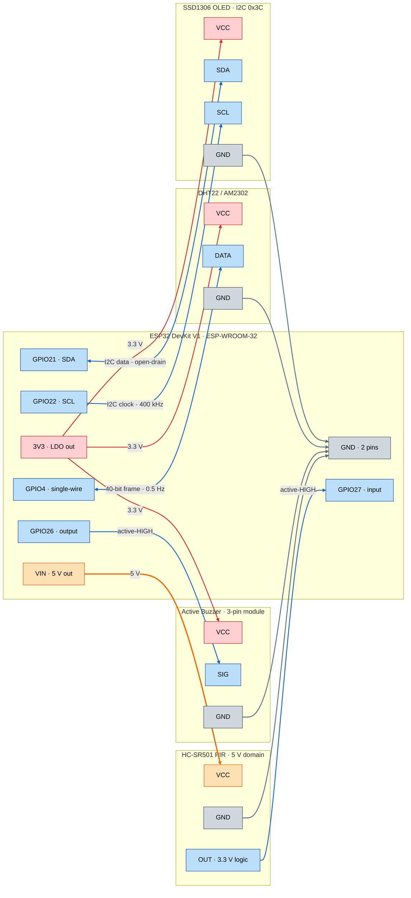
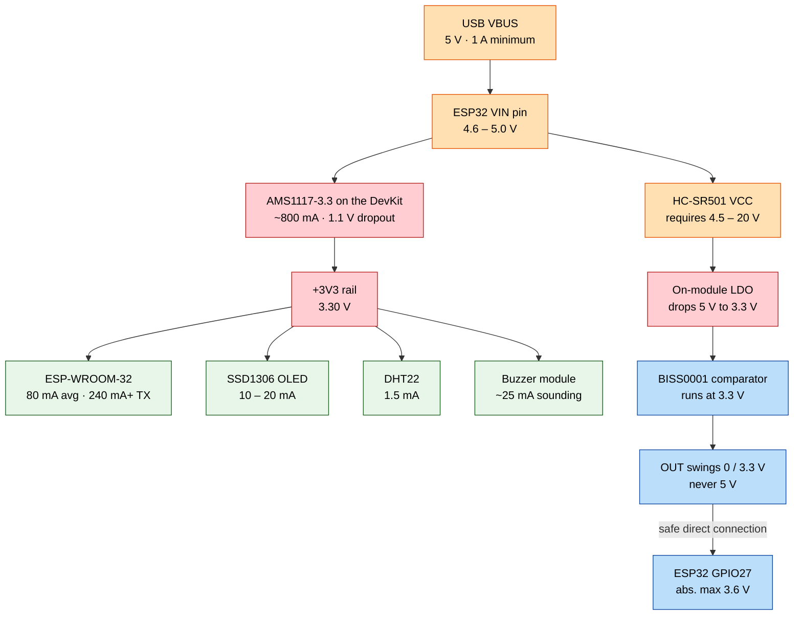

# LabSense — Hardware Reference

**Wiring diagrams, electrical schematics, simulation model, and design notes for the LabSense environmental monitor.**

This document is the authoritative electrical reference for the project. The [README](../README.md#3-wiring--pinout) gives the short version; everything here is the long version — full net list, text schematics, a Mermaid graph, a ready-to-run Wokwi simulation, and the engineering rationale behind the voltage domains and bus design.

| | |
| :--- | :--- |
| **MCU board** | ESP32 DevKit V1 (DOIT, 30-pin, ESP-WROOM-32) |
| **Supply** | 5 V ≥ 1 A over USB |
| **Voltage domains** | 3.3 V logic everywhere · 5 V power for the PIR only |
| **Buses** | 1 × hardware I²C (400 kHz) · 1 × proprietary single-wire (DHT) · 2 × plain GPIO |
| **External components** | **None.** No resistors, transistors, or level shifters — every peripheral is a self-contained breakout. |
| **Free GPIOs after build** | 19 (see [Figure 1](#31-figure-1--esp32-devkit-v1-physical-pin-map)) |

---

## Table of Contents

1. [Module Inventory](#1-module-inventory)
2. [Master Net List](#2-master-net-list)
3. [Text Schematics](#3-text-schematics)
4. [Mermaid Diagrams](#4-mermaid-diagrams)
5. [Simulate It in Wokwi](#5-simulate-it-in-wokwi)
6. [Engineering Notes](#6-engineering-notes)
7. [Bring-Up & Smoke Test](#7-bring-up--smoke-test)
8. [How This Document Was Verified](#8-how-this-document-was-verified)

---

## 1. Module Inventory

| Ref | Module | Interface | Supply | Logic level | Self-contained? |
| :-- | :--- | :--- | :--- | :--- | :--- |
| **U1** | ESP32 DevKit V1 (ESP-WROOM-32) | — | 5 V USB → on-board LDO | 3.3 V | — |
| **U2** | SSD1306 0.96" OLED, 128×64 | I²C @ `0x3C` | 3.3 V | 3.3 V | Yes — I²C pull-ups fitted |
| **U3** | DHT22 / AM2302, 3-pin breakout | Single-wire | 3.3 V | 3.3 V | Yes — data pull-up fitted |
| **U4** | HC-SR501 PIR | Digital, active-HIGH | **5 V** | **3.3 V** | Yes — on-board LDO + BISS0001 |
| **U5** | Active buzzer, 3-pin driver module | Digital, active-HIGH | 3.3 V | 3.3 V | Yes — driver transistor fitted |

> **The 3-pin variants matter.** The DHT22 breakout and the buzzer module carry the components that a bare sensor would need you to add yourself (a pull-up resistor and a driver transistor respectively). If you substitute a bare 4-pin AM2302 or a naked piezo element, see [§6.4](#64-the-dht22-single-wire-bus) and [§6.2](#62-power-integrity--decoupling) — you will need to add those parts.

---

## 2. Master Net List

The circuit has **eight nets**. Everything else on the ESP32 header is unconnected.

| Net | Nominal | Nodes | Topology | Notes |
| :--- | :--- | :--- | :--- | :--- |
| `+3V3` | 3.30 V | U1 `3V3` · U2 `VCC` · U3 `VCC` · U5 `VCC` | Star from the `3V3` pin | On-board LDO output, ~700 mA of headroom |
| `+5V` | 4.6–5.0 V | U1 `VIN` · U4 `VCC` | Point-to-point | `VIN` used as a **source**, back-fed from USB VBUS — see [§6.1](#61-voltage-domains--why-the-pir-gets-5-v-and-the-esp32-survives) |
| `GND` | 0 V | U1 `GND` ×2 · U2 `GND` · U3 `GND` · U4 `GND` · U5 `GND` | Star at the board | Single common return for both voltage domains |
| `I2C_SDA` | 3.3 V | U1 `GPIO21` · U2 `SDA` | Open-drain, bidirectional | Pull-up on U2 (typ. 4.7 kΩ) |
| `I2C_SCL` | 3.3 V | U1 `GPIO22` · U2 `SCL` | Open-drain, MCU-driven | Pull-up on U2 (typ. 4.7 kΩ) |
| `DHT_DATA` | 3.3 V | U1 `GPIO4` · U3 `DATA` | Open-drain, bidirectional | Pull-up on U3 (typ. 10 kΩ) |
| `PIR_OUT` | 3.3 V | U4 `OUT` · U1 `GPIO27` | Push-pull, module → MCU | Active-HIGH; 3.3 V even though U4 runs on 5 V |
| `BUZZ_SIG` | 3.3 V | U1 `GPIO26` · U5 `SIG` | Push-pull, MCU → module | Active-HIGH; drives a transistor base, not the coil |

### Connection table (per module)

| Module | Module pin | → | ESP32 pin | Header side | Wire colour used in the figures |
| :--- | :--- | :-: | :--- | :--- | :--- |
| **SSD1306 OLED** | `VCC` | → | `3V3` | Right, bottom | red |
| | `GND` | → | `GND` | Right, 2nd from bottom | black |
| | `SDA` | ↔ | `GPIO21` | Right, 5th from top | blue |
| | `SCL` | ← | `GPIO22` | Right, 2nd from top | green |
| **DHT22** | `VCC` | → | `3V3` | Right, bottom | red |
| | `GND` | → | `GND` | Right, 2nd from bottom | black |
| | `DATA` | ↔ | `GPIO4` | Right, 11th from top | white |
| **HC-SR501 PIR** | `VCC` | → | `VIN` | **Left, bottom** | red |
| | `GND` | → | `GND` | Left, 2nd from bottom | black |
| | `OUT` | → | `GPIO27` | Left, 10th from top | yellow |
| **Active buzzer** | `VCC` | → | `3V3` | Right, bottom | red |
| | `GND` | → | `GND` | Left, 2nd from bottom | black |
| | `SIG` | ← | `GPIO26` | Left, 9th from top | orange |

Arrow direction is signal flow: `→` into the named pin, `←` out of it, `↔` bidirectional.

---

## 3. Text Schematics

### 3.1 Figure 1 — ESP32 DevKit V1 physical pin map

Pins drawn with `●` carry a LabSense net; the rest are free. Pin **positions** are as they appear on the 30-pin DOIT board with the USB connector at the top.

```text
                                            ┌────────┐
                                            │ USB-µB │
                          ┌─────────────────┴────────┴─────────────────┐
                          │ EN                                  GPIO23 │
                          │ VN / GPIO39                   GPIO22 / SCL ├───●  I2C_SCL
                          │ VP / GPIO36                   GPIO1  / TX0 │
                          │ GPIO34  ADC1_CH6              GPIO3  / RX0 │
                          │ GPIO35                        GPIO21 / SDA ├───●  I2C_SDA
                          │ GPIO32                              GPIO19 │
                          │ GPIO33                              GPIO18 │
                          │ GPIO25                               GPIO5 │
            BUZZ_SIG  ●───┤ GPIO26                        GPIO17 / TX2 │
             PIR_OUT  ●───┤ GPIO27                        GPIO16 / RX2 │
                          │ GPIO14                               GPIO4 ├───●  DHT_DATA
                          │ GPIO12                               GPIO2 │
                          │ GPIO13                              GPIO15 │
                 GND  ●───┤ GND                                    GND ├───●  GND
                 +5V  ●───┤ VIN  5 V rail                          3V3 ├───●  +3V3
                          └────────────────────────────────────────────┘
```

> **Read the silkscreen, not the picture.** Clone boards occasionally transpose `VP`/`VN` or relabel `GND`. LabSense uses neither of those two pins, but always confirm `3V3`, `GND`, and `VIN` against your own board before the first power-up.

**Pins deliberately left free:** `GPIO34` (ADC1_CH6) is kept clear as the landing spot for a future analogue sensor — it is on ADC1, the only ADC block usable while Wi-Fi is active. See [§6.5](#65-gpio-selection-constraints).

### 3.2 Figure 2 — Interconnect schematic

This is a **logical** schematic: it shows net connectivity and signal direction, not the physical geometry of the header. (`3V3` and `GND` appear twice, marked `*` — they are the same physical pins, drawn in both halves so no wire has to cross the page.)

```text
  ┌────────────────────────┐                                   ┌────────────────────────┐
  │ HC-SR501  PIR          │                                   │ SSD1306 OLED 0.96"     │
  │ 5 V domain, BISS0001   │                                   │ 128x64  I2C  0x3C      │
  │                        │       ┌───────────────────┐       │                        │
  │                        │       │ ESP32             │       │                        │
  │                        │       │ DevKit V1         │       │                        │
  │  VCC ●───── red ───────├───────┤ VIN           3V3 ├───────┤────── red ─────● VCC   │
  │  GND ●───── blk ───────├───────┤ GND           GND ├───────┤────── blk ─────● GND   │
  │  OUT ●───── ylw ───────├──────▶┤ GPIO27     GPIO21 ├◀─────▶┤────── blu ─────● SDA   │
  │                        │       │            GPIO22 ├──────▶┤────── grn ─────● SCL   │
  └────────────────────────┘       │                   │       └────────────────────────┘
                                   │                   │
  ┌────────────────────────┐       │                   │       ┌────────────────────────┐
  │ Active Buzzer          │       │                   │       │ DHT22 / AM2302         │
  │ 3-pin, on-board Q1     │       │                   │       │ 3-pin, pull-up fitted  │
  │                        │       │                   │       │                        │
  │  VCC ●───── red ───────├───────┤ 3V3 *       3V3 * ├───────┤────── red ─────● VCC   │
  │  GND ●───── blk ───────├───────┤ GND *       GND * ├───────┤────── blk ─────● GND   │
  │  SIG ●───── org ───────├◀──────┤ GPIO26      GPIO4 ├◀─────▶┤────── wht ─────● DATA  │
  └────────────────────────┘       └───────────────────┘       └────────────────────────┘
```

Colour key: `red` = +3V3 · `red` on `VIN` = +5V · `blk` = GND · `blu`/`grn` = I²C · `wht` = DHT single-wire · `ylw` = PIR output · `org` = buzzer signal.

### 3.3 Figure 3 — Power bus distribution

```text
        USB VBUS — 5 V, 1 A minimum
        (host port, or a decent phone charger)
              │
              │   on-board path from the USB connector to VIN
              │   (direct link or a series Schottky, revision-dependent)
              ▼
   ═══════════╪═══════════════════════ +5V RAIL (VIN pin) ═══════════ 4.6 – 5.0 V ═══
              │                                       ║
              │                                       ╚══▶  U4  HC-SR501 VCC
              ▼                                                  65 µA quiescent
   ┌──────────────────────┐                                       < 1 mA triggered
   │  AMS1117-3.3  LDO    │   on the DevKit, SOT-223
   │  ~800 mA, 1.1 V drop │   dissipates (5 − 3.3) × I_load
   └──────────┬───────────┘
              ▼
   ═══════════╪═══════╦═══════════════╦═══════════════╦═══ +3V3 RAIL ═══ 3.30 V ±2 % ═══
              ║       ║               ║               ║
              ▼       ▼               ▼               ▼
      ESP-WROOM-32   U2 SSD1306     U3 DHT22       U5 Buzzer
      80 mA avg      10–20 mA       1.5 mA meas.   ~25 mA sounding
      240 mA+ on TX  27 mA all-lit  50 µA idle     0 mA idle

   ═══════════╪═══════╩═══════════════╩═══════════════╩═══════════╦═══ GND ═══ 0 V ═══
              ║                                                   ║
              ╚═══════════════════ star point at the ═════════════╝
                                   ESP32 GND pins            (U4 returns here too)
```

**Current budget on the 3.3 V rail**

| Load | Typical | Peak | Note |
| :--- | ---: | ---: | :--- |
| ESP-WROOM-32 (Wi-Fi associated) | 80 mA | 240–500 mA | TX bursts of ~2 ms dominate the transient behaviour |
| SSD1306 OLED | 10–20 mA | ~27 mA | Scales with lit pixels — an all-white screen is worst case |
| DHT22 | 1.5 mA while converting | 2.5 mA | 40–50 µA between the 2 s samples |
| Active buzzer module | 0 mA idle | 20–30 mA | Only while sounding, and drawn through the module's transistor — **not** through the GPIO |
| **Total** | **≈ 100 mA** | **≈ 560 mA** | Comfortably inside the LDO's ~800 mA rating |

The HC-SR501 sits on the 5 V rail and is electrically negligible (~65 µA). The real constraint is the USB supply and cable, not the regulator — see [§6.2](#62-power-integrity--decoupling).

---

## 4. Mermaid Diagrams

### 4.1 Full wiring graph



### 4.2 Power domain tree

Why a 5 V module can talk straight to a 3.3 V microcontroller:



---

## 5. Simulate It in Wokwi

The repository ships a ready-to-run [`diagram.json`](../diagram.json) at the project root. It reproduces the exact circuit above — same GPIOs, same voltage domains, no modifications needed.

**In the browser:** open [wokwi.com/projects/new/esp32](https://wokwi.com/projects/new/esp32), select the **diagram.json** tab, and paste the file below. Paste the LabSense sources into `sketch.ino`, add the libraries from §5.2, and press play.

**In VS Code:** install the *Wokwi for VS Code* extension, leave `diagram.json` where it is, and add a `wokwi.toml` pointing at your compiled `.bin`/`.elf`.

### 5.1 `diagram.json`

```json
{
  "version": 1,
  "author": "LabSense",
  "editor": "wokwi",
  "parts": [
    { "type": "board-esp32-devkit-v1",   "id": "esp",  "top": 0,    "left": 0,    "attrs": {} },
    { "type": "board-ssd1306",           "id": "oled", "top": -118, "left": 250,  "attrs": { "i2cAddress": "0x3c" } },
    { "type": "wokwi-dht22",             "id": "dht",  "top": 90,   "left": 262,  "attrs": { "temperature": "24.5", "humidity": "45" } },
    { "type": "wokwi-pir-motion-sensor", "id": "pir",  "top": -110, "left": -230, "attrs": {} },
    { "type": "wokwi-buzzer",            "id": "bz",   "top": 130,  "left": -190, "attrs": { "volume": "0.2", "mode": "smooth" } }
  ],
  "connections": [
    [ "esp:3V3",   "oled:VCC", "red",    [] ],
    [ "esp:GND.1", "oled:GND", "black",  [] ],
    [ "esp:D21",   "oled:SDA", "blue",   [] ],
    [ "esp:D22",   "oled:SCL", "green",  [] ],

    [ "esp:3V3",   "dht:VCC",  "red",    [] ],
    [ "esp:GND.1", "dht:GND",  "black",  [] ],
    [ "esp:D4",    "dht:SDA",  "white",  [] ],

    [ "esp:VIN",   "pir:VCC",  "red",    [] ],
    [ "esp:GND.2", "pir:GND",  "black",  [] ],
    [ "esp:D27",   "pir:OUT",  "gold",   [] ],

    [ "esp:D26",   "bz:2",     "orange", [] ],
    [ "esp:GND.2", "bz:1",     "black",  [] ]
  ],
  "dependencies": {}
}
```

**Pin-name notes** — these are part-definition names, which are not always the silkscreen names:

- `esp:D4` / `D21` / `D22` / `D26` / `D27` are GPIO 4 / 21 / 22 / 26 / 27.
- The board exposes exactly two grounds: `GND.1` (right column, beside `3V3`) and `GND.2` (left column, beside `VIN`). The 3.3 V group returns to `GND.1`, the 5 V and buzzer group to `GND.2`.
- `wokwi-dht22` calls its data pin `SDA`. It is **not** I²C — just an unfortunate label. The `NC` pin stays unconnected.
- `wokwi-buzzer` pin **`1` is negative and `2` is positive.** Reversing them is the classic mistake here; `esp:D26` goes to `bz:2`.

`top`/`left` are cosmetic — drag the parts wherever you like, the netlist is what matters.

### 5.2 `libraries.txt`

Wokwi needs the library list alongside the sketch:

```text
# Wokwi Library List
Adafruit SSD1306
Adafruit GFX Library
Adafruit BusIO
DHT sensor library
Adafruit Unified Sensor
```

### 5.3 `secrets.h` for the simulator

The simulator provides its own open network. Use it verbatim — the SSID is case-sensitive and the password must be an empty string:

```cpp
#define WIFI_SSID     "Wokwi-GUEST"
#define WIFI_PASSWORD ""
```

NTP resolves through Wokwi's gateway, so the clock and calendar pages populate normally once association completes.

### 5.4 Where the simulation differs from the bench

| | Bench hardware | Wokwi |
| :--- | :--- | :--- |
| **Buzzer** | 3-pin **active** module — `VCC`/`GND`/`SIG`, sounds on a steady logic HIGH | 2-pin **passive** piezo across `GPIO26` and `GND` |
| **Consequence** | `digitalWrite(PIN_BUZZER, HIGH)` beeps | A steady DC level produces no tone — the element renders the *frequency* of its drive waveform. Use `tone(PIN_BUZZER, 2000)` if you want audio in the sim; the firmware needs no change to run correctly otherwise. |
| **PIR** | Trim pots for sensitivity and delay, 2–3 s retrigger lockout | Click the sensor to fire a trigger |
| **DHT22** | Real thermal response, ~2 s conversion | Drag the temperature and humidity sliders |
| **Power rails** | LDO thermals, brownouts, and cable drop are all real | Idealised — the simulator will never show you a brownout |

That last row is the important one: **Wokwi validates your logic and your netlist, not your power integrity.** Every fault described in [§6.2](#62-power-integrity--decoupling) is invisible in simulation.

---

## 6. Engineering Notes

### 6.1 Voltage domains — why the PIR gets 5 V and the ESP32 survives

The ESP32's GPIOs are **not 5 V tolerant**. The absolute maximum on any pin is `VDD + 0.3 V` = **3.6 V**; past that you forward-bias the ESD clamp diode into the 3.3 V rail and the pin — or the whole chip — dies, either slowly or immediately. A 5 V module feeding a 3.3 V input normally demands a divider or a level shifter.

The HC-SR501 is the exception, and it is worth understanding *why* rather than taking it on faith:

1. The module carries **its own 3.3 V regulator** (typically an HT7133-1 or a 1117-family LDO) immediately behind the `VCC` pad.
2. The BISS0001 motion-detector IC and the output driver both run from **that regulated 3.3 V rail**, not from `VCC`.
3. `OUT` therefore swings between 0 V and **3.3 V** whether you feed the module 5 V or 12 V.

That makes `OUT → GPIO27` a direct, in-spec connection with no external parts.

**So why not power it from 3.3 V?** Because of the regulator's dropout voltage. Feed 3.3 V into an LDO that needs ~1 V of headroom and its output sags to roughly 2.3 V, under-volting the BISS0001. The failure is not clean: the module either never triggers or free-runs, retriggering on its own noise. The datasheet operating range is **4.5–20 V**, which is exactly why `VCC` goes to `VIN`.

> **`VIN` is being used as an output here.** On the DevKit V1, `VIN` is tied to the USB VBUS line (through a series Schottky on some revisions), so with the board powered over USB you can draw 5 V *out* of that pin. Two consequences follow: if you later run the board from a battery on the `3V3` pin, `VIN` goes dead and the PIR stops working; and you should not feed an external supply into `VIN` while USB is connected unless your board revision has the protection diode.

**Verify your specific module before trusting it.** Some clones — the "mini" AM312-style boards in particular, plus a few counterfeit HC-SR501s — bypass the regulator and drive `OUT` at `VCC` level:

1. Power the module from 5 V with `OUT` disconnected from the ESP32.
2. Wave at it to force a trigger.
3. Measure `OUT` → `GND` with a multimeter.

Expect **3.2–3.4 V**. If you read ~5 V, fit a divider before connecting: `R1 = 10 kΩ` from `OUT` to the tap, `R2 = 20 kΩ` from the tap to `GND`, signal taken at the tap → `5 × 20/(10+20) = 3.33 V`. The BISS0001's output impedance is low enough that the ~167 µA through the divider is irrelevant.

Every other peripheral in LabSense is natively 3.3 V, so no other level translation exists anywhere in the circuit.

### 6.2 Power integrity & decoupling

No external parts are *required*. But on a breadboard with long Dupont leads, these are the additions that turn an intermittent build into a reliable one.

**Decoupling**

- **100 nF X7R ceramic across `VCC`/`GND` at every module header**, as physically close to the pins as you can manage. This is the single highest-value addition to the circuit.
- **10–47 µF bulk on the `+3V3` rail** near the ESP32 if your leads exceed ~15 cm. The aggressor is the Wi-Fi transmitter: it pulls 240–500 mA in ~2 ms slices, and the inductance of a 20 cm jumper is enough to turn that into a visible rail dip.
- **100–470 µF on the `+5V` rail** if buzzer activity coincides with resets.

**Brownouts**

`Brownout detector was triggered` on the serial console is almost never a firmware problem. In order of likelihood: a thin or long USB cable (28 AWG charging cables drop 0.4 V or more under 500 mA), a weak USB port, then a missing bulk capacitor. Swap the cable first — it fixes this more often than anything else.

**Grounding**

Return every module's `GND` to the ESP32's own ground pins in a star, rather than daisy-chaining them along one breadboard rail. Breadboard contacts run from milliohms to a full ohm as they age, and the buzzer's pulsed current across that resistance produces ground bounce that shows up as corrupted I²C transactions. A garbled OLED is a surprisingly common symptom of a buzzer grounding problem.

**Buzzer specifics**

A magnetic active buzzer is an inductive load. The 3-pin driver module should include a flyback diode across the coil, though the cheapest ones sometimes omit it. If the display glitches or the board resets each time the buzzer fires, add a 1N4148 across the buzzer terminals with the cathode to `VCC`.

Note that `GPIO26` only drives the **base** of the module's transistor through its base resistor — a couple of milliamps — so the ESP32's ~20 mA continuous per-pin budget is never in play. That is precisely why the BOM insists on a module rather than a bare element: a raw piezo drawing 30 mA straight from a GPIO is out of spec, and a raw magnetic buzzer would also dump its inductive kickback into the pin.

**Sensor placement**

Mount the DHT22 away from the ESP32 module and the LDO. Both are meaningful heat sources at this scale, and a sensor sitting 2 cm downwind of the regulator reads 1–2 °C high. With `TEMP_ALERT_THRESHOLD` at 30 °C, that offset is the difference between a correct alarm and a nuisance one. The edge of the breadboard, or flying leads, is the right answer.

### 6.3 I²C bus engineering

**Hardware peripheral.** The ESP32 has two hardware I²C controllers. `GPIO21`/`GPIO22` are the default `SDA`/`SCL` mapping for `Wire` (I2C0), so `Wire.begin()` binds the silicon peripheral rather than a bit-banged bus. The GPIO matrix *can* route I²C to almost any pin, but staying on the defaults means zero configuration and matches what `Adafruit_SSD1306` assumes.

**Open-drain and pull-ups.** Both lines are open-drain: devices pull LOW and release to let a resistor pull HIGH. Nothing ever drives the bus high. The SSD1306 module carries its own pull-ups — typically 4.7 kΩ, occasionally 10 kΩ, to its `VCC`.

> **Do not add external pull-ups.** With the module's 4.7 kΩ already fitted, adding another 4.7 kΩ in parallel gives 2.35 kΩ and 1.4 mA of sink current. Survivable with one device, but the habit does not scale: the I²C specification budgets **3 mA** of sink current, and once you exceed it `V_OL` rises until LOWs stop being recognised.

**Rise time is the real speed limit.** `Adafruit_SSD1306` does not set the bus clock in `begin()` — it wraps every transfer in a transaction that switches the bus to **400 kHz** (Fast mode) for the duration and restores it to 100 kHz afterwards. Those two values are the `clkDuring`/`clkAfter` constructor defaults, and `display.cpp` uses the four-argument constructor, so LabSense takes them as-is. Fast mode caps rise time at **300 ns**. Bus rise time is `t_r ≈ 0.8473 × R_pullup × C_bus`. With the module's 4.7 kΩ:

| Bus capacitance | t_r | 400 kHz Fast mode | 100 kHz Standard mode |
| ---: | ---: | :--- | :--- |
| 50 pF (short leads) | ~200 ns | Within spec | Within spec |
| 75 pF | ~300 ns | At the limit | Within spec |
| 100 pF (~30 cm of jumper) | ~400 ns | **Out of spec** | Within spec |

Dupont jumper wire contributes roughly **1 pF/cm** and the SSD1306's own pins add ~10 pF. The practical rule: **keep `SDA`/`SCL` under about 20 cm.** For a longer run, slow the bus down — but note that calling `Wire.setClock()` after `display.begin()` will *not* stick, because the library re-applies its own clock at the start of every transaction. Change it at construction instead:

```cpp
// display.cpp — 100 kHz during transfers and after, instead of 400/100
static Adafruit_SSD1306 display(SCREEN_WIDTH, SCREEN_HEIGHT, &Wire, OLED_RESET, 100000UL, 100000UL);
```

That quadruples the rise-time budget at the cost of ~70 ms per full-frame push. The absolute ceiling for both modes is 400 pF of total bus capacitance.

**Frame time.** A full 128×64 framebuffer is 1024 bytes. With the control byte and per-byte ACKs, one complete `display()` costs roughly 9,270 clock periods — about **23 ms at 400 kHz** (and ~93 ms if you drop the bus to 100 kHz). That number is why `DISPLAY_REFRESH_INTERVAL` is 200 ms: at 5 fps the OLED consumes ~12 % of wall-clock time, and pushing frames faster buys nothing visible while starving PIR polling.

**Addressing.** `SCREEN_ADDRESS` is `0x3C`, the **7-bit** address — it appears on a logic analyser as `0x78` (write) and `0x79` (read). Nearly every 128×64 module ships as `0x3C`; a minority are `0x3D`, selectable by moving a resistor or bridging a jumper on the back. If the display stays dark but the rest of the firmware runs, scan the bus:

```cpp
for (uint8_t a = 1; a < 127; a++) {
  Wire.beginTransmission(a);
  if (Wire.endTransmission() == 0) { Serial.printf("I2C device at 0x%02X\n", a); }
}
```

### 6.4 The DHT22 single-wire bus

Despite appearances, this is **not** Dallas 1-Wire. It is a proprietary bidirectional protocol on a single pulled-up line: the MCU holds the line LOW for at least 1 ms to request a sample, releases it, and the sensor answers with an 80 µs LOW / 80 µs HIGH preamble followed by 40 data bits encoded as pulse widths.

- **Pull-up:** 4.7 kΩ–10 kΩ to 3.3 V, already fitted on the 3-pin breakout. A bare 4-pin AM2302 has none — add one between `DATA` and `3V3` or every read returns `NaN`.
- **This is the one blocking call in LabSense.** The library bit-bangs the frame with interrupts disabled for roughly 5 ms. It is bounded, unavoidable with this sensor, and happens once every 2 s — but it is worth knowing that the project's "no blocking code" guarantee carries exactly this one asterisk.
- **2 s minimum between reads.** `DHT_READ_INTERVAL` is 2000 ms because the sensor's conversion cycle is ~2 s. Polling faster returns stale data or `NaN`, and self-heats the element into reading high.
- **Cable length:** 20 cm or less at the stock pull-up. Longer runs need a lower-value pull-up and ideally shielded cable.

### 6.5 GPIO selection constraints

A condensed version of the reasoning in [README §3.3](../README.md#33-why-these-pins) — the constraints that bounded the choice:

| Pins | Constraint | Consequence for LabSense |
| :--- | :--- | :--- |
| `GPIO6`–`GPIO11` | Hard-wired to the SPI flash | Unusable — touching them breaks boot |
| `GPIO0`, `2`, `12`, `15` | Strapping pins, sampled at reset | Avoided; an external pull can force download mode or the wrong flash voltage |
| `GPIO34`–`GPIO39` | Input-only, no internal pull-ups | Cannot drive the buzzer; reserved for a future analogue input |
| `ADC2` pins | Owned by the Wi-Fi driver while the radio is up | LabSense performs no analogue reads; any future one **must** land on ADC1 (`GPIO32`–`GPIO39`) |
| `GPIO21`, `GPIO22` | Default hardware I²C | Chosen for the OLED |
| `GPIO4`, `26`, `27` | Unencumbered, no boot-time role | DHT, buzzer, PIR. `GPIO26` in particular stays quiet through reset, so the buzzer does not chirp on power-up |

---

## 7. Bring-Up & Smoke Test

Work through this in order the first time you assemble the board.

**Before power**

1. Wire everything with the USB cable **unplugged**.
2. Check `3V3` → `GND` resistance with a multimeter. Anything under ~1 kΩ means a short — find it before applying power.
3. **Verify the two easy-to-swap connections:** the PIR's `VCC` must land on `VIN`, and the OLED's `VCC` must land on `3V3`. Reversing these is the most common destructive mistake in this build — many SSD1306 modules have no input regulator and will not survive 5 V.
4. Confirm every module's `GND` reaches an ESP32 `GND` pin.

**First power-up**

5. Plug in USB and immediately feel the ESP32 module and the LDO. Warm is normal; too hot to touch means unplug now.
6. Measure `3V3` → `GND`: expect **3.25–3.35 V**. Measure `VIN` → `GND`: expect **4.6–5.1 V**.
7. Open the serial monitor at **115200** baud. You should see:

```text
--- LabSense boot ---
[ok] sensors DHT22/PIR/buzzer
[ok] display SSD1306 128x64
[..] network Wi-Fi associating, NTP in background
--- running ---
```

**Functional checks**

8. The OLED should light within a second of boot. If it stays dark, scan the I²C bus ([§6.3](#63-i²c-bus-engineering)) before suspecting anything else.
9. Wait 2–3 s for the first DHT sample. Temperature and humidity should read plausibly; `NaN` points at the pull-up or the data wire.
10. Wave a hand in front of the PIR. Expect a single short beep and the motion page on the display. The HC-SR501 needs **30–60 s after power-up to stabilise** — spurious triggers inside that window are normal, not a fault.
11. Warm the DHT22 above 30 °C (a cupped hand works) to confirm the intermittent temperature alarm and the alert page.
12. Give Wi-Fi 10–30 s, then check that the clock page shows real time rather than `--:--:-- --`.

---

## 8. How This Document Was Verified

- **Pinout** cross-checked line by line against [`config.h`](../config.h): `PIN_OLED_SDA` 21, `PIN_OLED_SCL` 22, `PIN_DHT_DATA` 4, `PIN_PIR_MOTION` 27, `PIN_BUZZER` 26, `SCREEN_ADDRESS` 0x3C.
- **Wokwi part names and pin labels** taken from the official part definitions for `wokwi-dht22`, `board-ssd1306`, `wokwi-pir-motion-sensor`, and `wokwi-buzzer`, plus the `esp32-devkit-v1` board definition — which is also the source for the physical pin ordering and the two-ground layout in Figure 1.
- **`diagram.json`** is JSON-validated and references only pin names present in those definitions.
- **Firmware behaviour** in §5.4 and §7 read from [`sensors.cpp`](../sensors.cpp) and [`LabSense.ino`](../LabSense.ino). The buzzer is driven with `digitalWrite()`, which is what makes the passive-piezo caveat in §5.4 apply.
- **Current figures** are datasheet typicals for the named parts. Treat them as a design budget, not as measurements of your specific modules.
